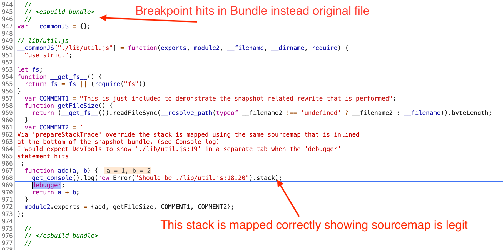
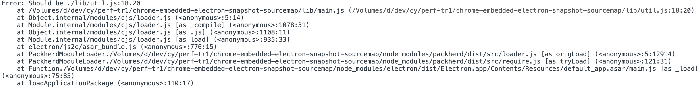
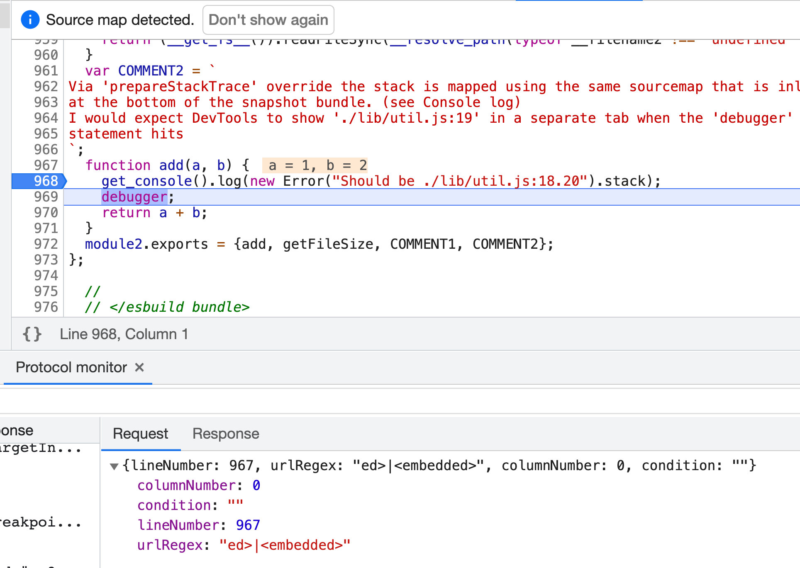
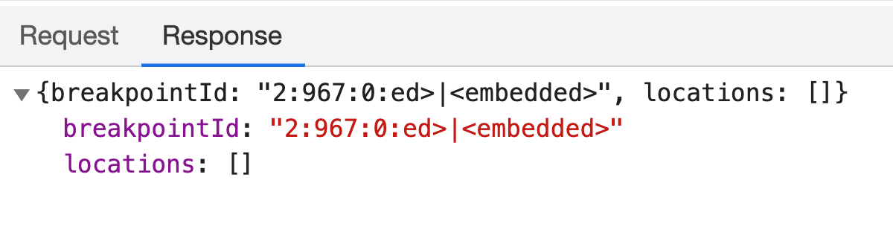

# chrome-embedded-electron-snapshot-sourcemap

Demonstrating issue with sourcemap application for embedded snapshot in Electron app.

## Steps

```sh
npm install -f
npm run install-snapshot
npm run debug
```

Once DevTools opens it will break.

_Continue_ and you hit a `debugger` statement. Read the `COMMENT2` above and inspect the
DevTools Console which shows that sourcemaps are indeed correct as they are used to map the
error stack trace.

However DevTools shouldn't show me the `<embedded>` script but the
[`./lib/util.js`](./lib/util.js) instead if
sourcemaps work here.

## What You'll See

### Hitting the Breakpoint



##### Console with mapped error



### Setting another Breakpoint



As you see above the request to set a breakpoint seems to have a broken 
`urlRegex: "ed>|<embedded>"`. `<,|,>` have special meanings in a regex as well.

Another detail showing is that DevTools seems to detect a sourcemap, but doesn't properly
consume it.



Similarly for the response `breakpointId: "2:967:0:ed>|<embedded>"`
