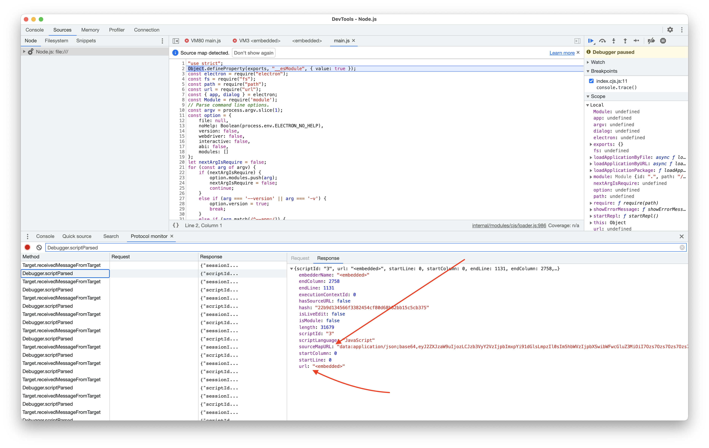

# chrome-embedded-electron-snapshot-sourcemap

Demonstrating issue with sourcemap application for embedded snapshot in Electron app.

## Steps

```sh
npm install -f
npm run install-snapshot
npm run debug
```

## Steps on Windows

Four scripts to get up and running in windows (via PowerShell) have been provided.

```
./scripts/install-and-debug.ps1
./scripts/install-and-run.ps1
./scripts/debug.ps1
./scripts/run.ps1
```

Thus after running `npm install`, you can run one of the `install-*` scripts to get create the
snapshot and run the application.

After that either `run.ps1` or `debug.ps1` suffice to run the application with the same
embedded snapshot again.

## Encountering Issue in DevTools

Once DevTools opens it will break.

_Continue_ and you hit a `debugger` statement. Read the `COMMENT2` above and inspect the
DevTools Console which shows that sourcemaps are indeed correct as they are used to map the
error stack trace.

However DevTools shouldn't show me the `<embedded>` script but the
[`./lib/util.js`](./lib/util.js) instead if
sourcemaps work here.

## What You'll See

### Debugger.scriptParsed

This message shows that the script was parsed and the sourcemap for `<embedded>` found.



### Hitting the Breakpoint


##### Console with mapped error


### Setting another Breakpoint


As you see above the request to set a breakpoint seems to have a broken 
`urlRegex: "ed>|<embedded>"`.

Considering `<,|,>` have special meanings in a regex as well this might be part of the issue.

Another detail showing is that DevTools seems to detect a sourcemap, but doesn't properly
consume it.


Similarly for the response `breakpointId: "2:967:0:ed>|<embedded>"`
